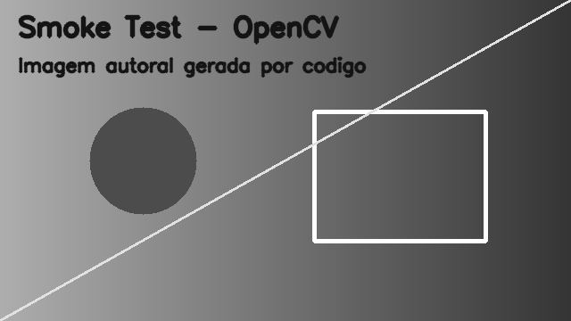

# ProcessamentoImagem
Repositório atividades matéria processamento de imagens

## Ambiente de Desenvolvimento

- **Sistema Operacional:** Windows 11 (64 bits)
- **Processador:** (ex: Intel Core i7 13650hx)
- **Memória RAM:** (ex: 16 GB)

## Evidência do Teste Nativo

